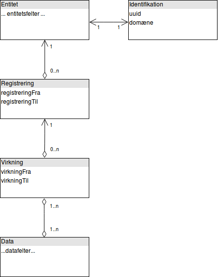

.. _bitemporality:

Bitemporal datamodel
====================

Vores datamodel er opbygget som følger:
En klasse repræsenterer den overordnede dataentitet, f.eks. "Person", nedarvende fra Core-klassen Entity.
Herfra refereres til et objekt af typen "Identification", som lagrer UUID og domæne for entiteten.
Hver entitet kan kun have én identifikation, og omvendt.

Entiteten har derunder en række Registreringer, hver med sin tidsafgrænsning, som del af entitetens bitemporalitet.
Registreringen har derunder et antal virkninger, også med tidsafgrænsning, som den anden del af bitemporaliteten.

Virkninger har derefter en mange-til-mange relation til Dataobjekter, hvor hvert dataobjekt kan være tilkoblet flere virkninger i flere registreringer.
Disse repræsenterer en lille stump af entitetens data, som har den refererede bitemporalitet.
Andre dataobjekter indeholder så andre datastumper med anden bitemporalitet, og sammen udgør de et helt billede af entiteten.
Hver datastump har også et tidsstempel for hvornår det sidst blev opdateret,
så der kan udtrækkes en afgrænset mængde af dataobjekter som er ændret siden et givet tidspunkt.

